# DonDone

> 당신의 돈(Don), 처음부터 끝(Done)까지 던던하게.

DonDone은 외국인 근로자를 위한 급여 지갑 서비스입니다. 근로자의 출퇴근 기록을 단순 근태 데이터로 끝내지 않고, 미리받기, 급여 확인, 송금, 보관, 증빙 문서 생성까지 이어지는 금융 행동의 근거로 사용합니다. 회사에는 같은 근무 데이터를 기반으로 선지급 가능 대상, 수정 요청, 정산 이슈를 확인하는 운영 콘솔을 제공합니다.

## 핵심 가치

- 근로자: 일한 기록을 기반으로 지금 쓸 수 있는 돈, 급여 이상 여부, 가족 송금, 증빙 문서까지 한 앱에서 확인합니다.
- 고용주: 출퇴근 누락, 위치 이슈, 수정 요청, 선지급 가능 대상, 근로자 요약을 운영 콘솔에서 확인합니다.
- 서비스 신뢰: 근무 기록, 급여 검증, 송금 영수증, Proof Pack 같은 근거 자료를 PDF와 해시 기반 무결성 증빙으로 연결합니다.

## 주요 기능

| 영역 | 기능 |
| --- | --- |
| WorkProof | GPS 기반 출근/퇴근, 근무지 반경 검증, 수정 사유와 감사 로그, 근무 기록 PDF |
| Wage Shield | 반영된 근무 기록과 실제 입금액 비교, 차액 원인 스냅샷, 회사 1차 확인과 외부 도움 준비 |
| Advance | 근무 반영분 기반 미리받기 가능 금액 계산, 신청, 관리자 승인, dUSDC 지급 상태 추적 |
| Remittance | 수신자 허용 목록, SafePay 사전 검증, 테스트넷 송금, 트랜잭션 상태 추적, 영수증 생성 |
| Vault | 데모 스테이블코인 보관, 예상 이자, 입출금 트랜잭션 상태 추적 |
| Documents & Claim | Proof Pack, Claim Kit, WorkProof Statement, Transfer Receipt 생성과 다운로드 |
| Employer Web | 고용주 로그인, 대시보드, 근로자 목록, 수정 요청 관리, 사업장 설정, 회사 코드 발급 |
| Admin | 회사 생성, 고용주 가입 코드 확인, 미리받기 요청 승인/거절, 송금 운영 조회 |
| Mobile UX | Kotlin Compose 기반 근로자 앱, 다국어 모드, Kakao Map, 로컬 fallback demo state |

## 서비스 화면

<table>
  <tr>
    <th align="center">다국어 지원</th>
    <th align="center">GPS 기반 출퇴근</th>
    <th align="center">급여 점검</th>
    <th align="center">PDF 생성</th>
  </tr>
  <tr>
    <td align="center">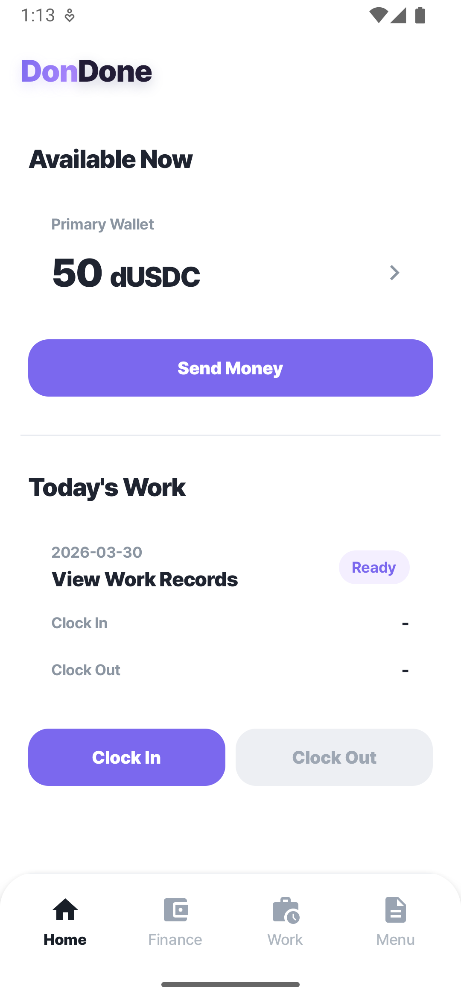</td>
    <td align="center">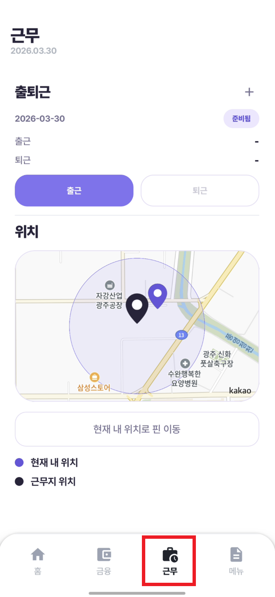</td>
    <td align="center">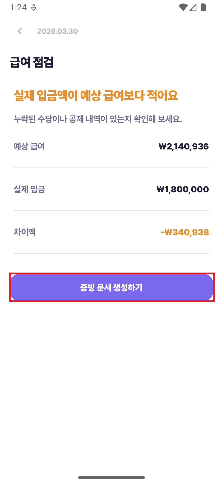</td>
    <td align="center">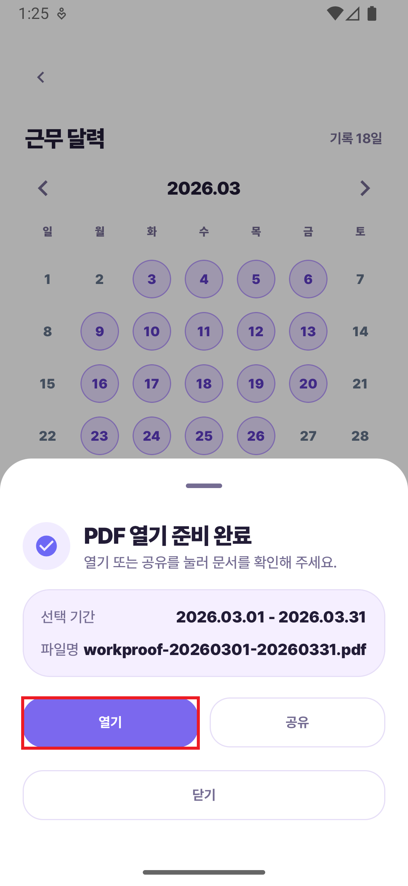</td>
  </tr>
  <tr>
    <th align="center">PDF 화면</th>
    <th align="center">미리받기</th>
    <th align="center">송금</th>
    <th align="center">이자(예치)</th>
  </tr>
  <tr>
    <td align="center">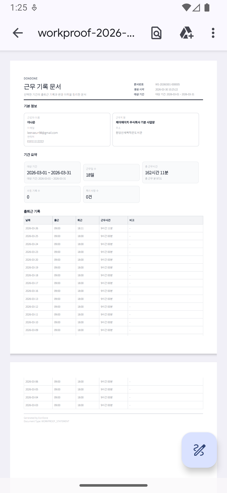</td>
    <td align="center">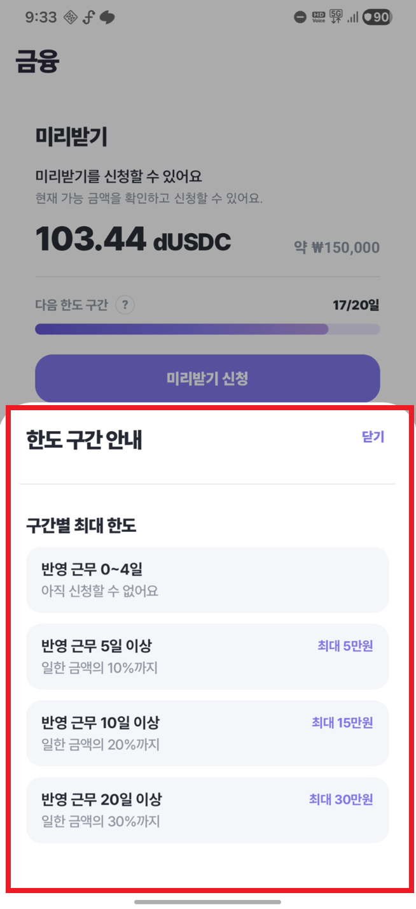</td>
    <td align="center">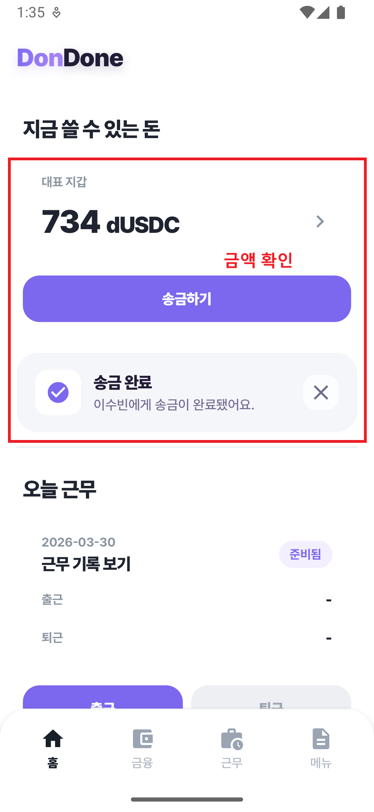</td>
    <td align="center">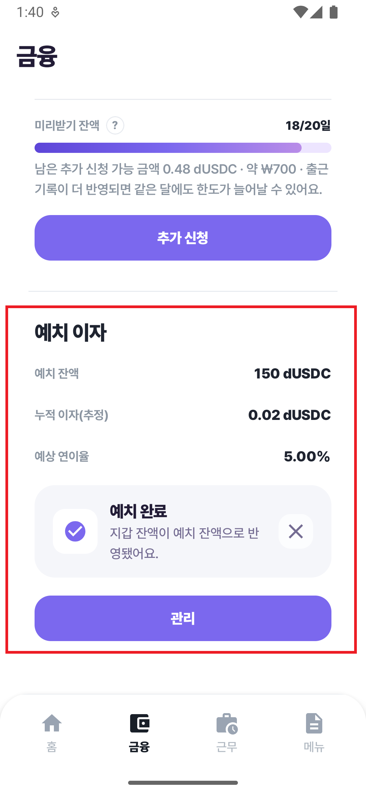</td>
  </tr>
</table>

## 아키텍처

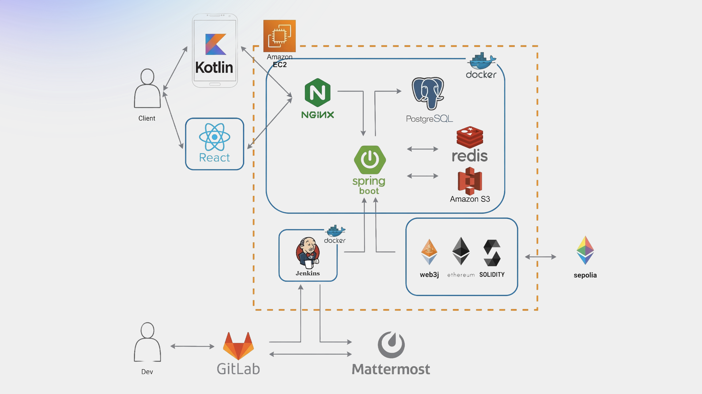

요약 흐름은 다음과 같습니다.

1. 모바일 앱과 웹 콘솔이 Nginx를 통해 Spring Boot API에 접근합니다.
2. Spring Boot API는 PostgreSQL에 업무 데이터를 저장하고 Redis를 캐시와 비동기 처리 보조 저장소로 사용합니다.
3. 송금, 보관, 문서 해시 증빙은 Web3j와 Solidity 컨트랙트를 통해 Sepolia 테스트넷 또는 demo adapter로 처리합니다.
4. Docker Compose가 API, 웹, DB, Redis, Nginx, Jenkins를 묶고, Jenkins가 테스트, 마이그레이션, 재배포, 헬스 체크를 수행합니다.
5. Jenkins 결과는 Mattermost로 알림을 전송합니다.

## 기술 스택

| 구분 | 기술 |
| --- | --- |
| Backend | Java 17, Spring Boot 3.2.5, Spring Security, JWT, Spring Data JPA, Querydsl, Bean Validation, Springdoc OpenAPI, Actuator |
| PDF/문서 | Thymeleaf, OpenHTMLtoPDF, NotoSansKR |
| Blockchain | Solidity 0.8.24, Foundry, Web3j, Sepolia, DemoStableToken, SafePayRemittance, StableVault, DocumentHashRegistry |
| Database/Cache | PostgreSQL 16, Redis 7.4.8 |
| Mobile | Kotlin, Android Compose, Material3, Navigation Compose, OkHttp, AndroidX Security Crypto, Kakao Map SDK |
| Web | React 18, TypeScript, Vite 5, React Router 6, Nginx |
| Infra/DevOps | Docker Compose, Nginx, Jenkins, DuckDNS, Let's Encrypt, Prometheus, Grafana, MinIO, Mattermost |

## 저장소 구조

```text
.
├── apps
│   ├── dondone-backend      # Spring Boot API 서버
│   ├── dondone-mobile       # Android/Kotlin 근로자 앱과 HTML mockup
│   ├── dondone-web          # React 고용주/관리자 웹 콘솔
│   └── dondone-blockchain   # Foundry Solidity 컨트랙트
├── deploy
│   ├── nginx                # 운영 reverse proxy 설정
│   ├── observability        # Prometheus/Grafana 설정
│   └── sql                  # 운영 DB 마이그레이션과 데모 seed SQL
├── docs                     # PRD, API 명세, 웹 정책, 개발 문서
├── exec                     # 제출/시연 문서, 이미지, DB dump
├── docker-compose.yml       # 운영 배포 compose
├── docker-compose.dev.yml   # 로컬 개발 인프라 compose
└── Jenkinsfile              # CI/CD 파이프라인
```

## 백엔드 API

백엔드 API는 `ApiResponse<T>` 응답 envelope와 JWT 기반 stateless 인증을 사용합니다. 구현 기준 API 카탈로그는 [docs/DonDone_API_Spec_Implemented_v1.md](docs/DonDone_API_Spec_Implemented_v1.md)에 정리되어 있으며, controller 기준 총 93개 endpoint가 포함되어 있습니다.

권한 기준은 다음과 같습니다.

| 권한 | 경로 |
| --- | --- |
| Public | `POST /api/auth/signup`, `POST /api/auth/login`, `/api/employer-auth/**`, `GET /health`, Swagger/OpenAPI |
| USER 또는 ADMIN | 일반 근로자 API `/api/**` |
| EMPLOYER | `/api/employer/**` |
| ADMIN | `/api/admin/**` |

중복 요청 방지를 위해 일부 생성 API는 `Idempotency-Key` 헤더를 사용합니다. 대표적으로 Proof Pack, Claim Kit, WorkProof 문서 생성은 필수이고, 미리받기, 송금, Vault 입출금은 선택 적용됩니다.

## DB 구조 요약

운영 스키마 기준 상세 테이블은 [exec/db-dumps/dondone_20260330_092603.sql](exec/db-dumps/dondone_20260330_092603.sql)과 [deploy/sql](deploy/sql)을 기준으로 확인할 수 있습니다. README에서는 전체 테이블을 한 장에 몰아넣지 않고, 도메인별 핵심 관계만 나누어 표시합니다.

### 전체 흐름

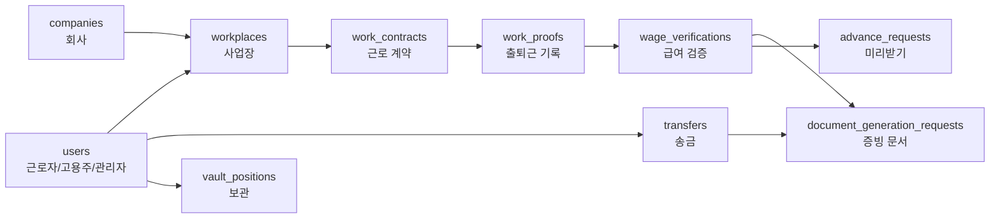

| 그룹 | 핵심 테이블 | 역할 |
| --- | --- | --- |
| 계정/조직 | `users`, `companies`, `employer_profiles`, `employment_memberships` | 근로자, 고용주, 관리자와 회사 소속 관계 |
| 근무 | `workplaces`, `work_contracts`, `work_proofs`, `work_proof_audit_logs` | 사업장, 계약, 출퇴근 기록, 수정 이력 |
| 급여/증빙 | `wage_deposits`, `wage_verifications`, `document_generation_requests`, `claim_preparations` | 실제 입금액 비교, 차액 원인, PDF/클레임 준비 |
| 금융 | `advance_requests`, `advance_payouts`, `recipients`, `transfers`, `vault_positions`, `vault_transactions` | 미리받기, 테스트넷 송금, 보관 |
| 운영 작업 | `jobs` | 송금, 보관, 미리받기 지급의 비동기 처리 |

### 근무/급여/증빙

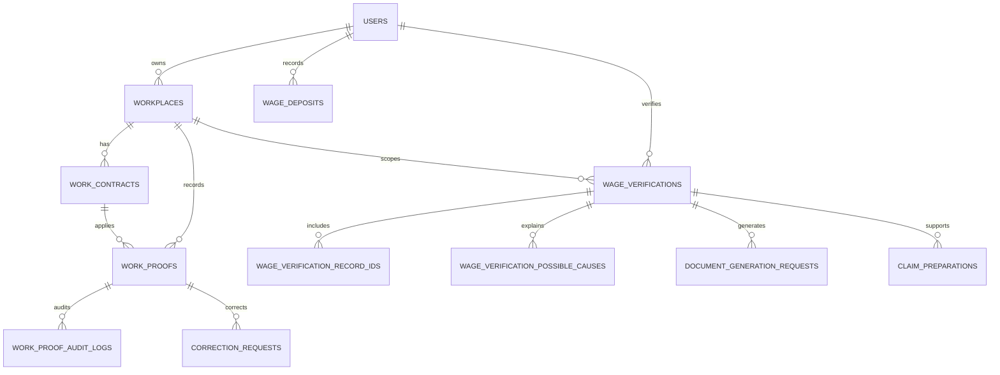

### 고용주 운영

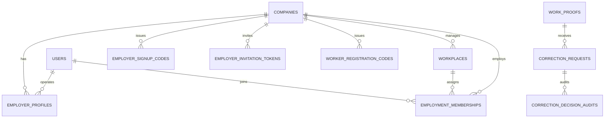

### 금융/블록체인/비동기

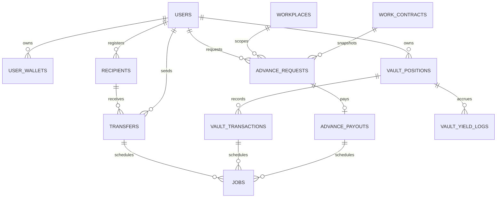

참고로 `jobs`는 `reference_kind`와 `reference_id` 기반의 비동기 작업 테이블이라 물리 FK보다 애플리케이션 레벨 연결에 가깝습니다. `advance_policies`는 미리받기 가능 금액과 지급 정책을 계산할 때 사용하는 정책 테이블입니다.

## 로컬 실행

### 1. 공통 환경 파일

```bash
cd DunDun/S14P21C202
cp .env.example .env
```

백엔드와 개발 DB 실행에는 최소한 아래 값이 필요합니다.

```dotenv
POSTGRES_DB=dondone
POSTGRES_USER=dondone
POSTGRES_PASSWORD=<local-password>
JWT_SECRET=<long-random-secret>
SPRING_PROFILES_ACTIVE=local
REMITTANCE_CHAIN_MODE=demo
VAULT_CHAIN_MODE=demo
```

MinIO까지 함께 올릴 때는 아래 값도 설정합니다.

```dotenv
MINIO_ROOT_USER=minio
MINIO_ROOT_PASSWORD=<local-password>
```

실제 비밀번호, JWT secret, private key, 외부 API key는 커밋하지 않습니다.

### 2. 개발 인프라

백엔드 로컬 실행에 필요한 PostgreSQL과 Redis만 먼저 올립니다.

```bash
docker compose -f docker-compose.dev.yml up -d postgres redis
```

선택적으로 문서 저장소와 관측 도구를 함께 사용할 수 있습니다.

```bash
docker compose -f docker-compose.dev.yml up -d minio minio-init prometheus grafana
```

### 3. Backend

```bash
cd apps/dondone-backend
./gradlew bootRun
```

- API 서버: `http://localhost:8080`
- Health: `http://localhost:8080/health`
- Swagger UI: `http://localhost:8080/swagger-ui.html`

### 4. Web

```bash
cd apps/dondone-web
npm install
npm run dev
```

운영 환경에서는 Nginx same-origin `/api` 라우팅을 사용하므로 `VITE_API_BASE_URL`을 비워 둘 수 있습니다. 웹만 단독 실행할 때는 `apps/dondone-web/.env.example`을 참고해 필요한 값을 설정합니다.

### 5. Android

```bash
cd apps/dondone-mobile/android
cp local.properties.example local.properties
./gradlew assembleDebug
```

`local.properties` 주요 값은 다음과 같습니다.

```properties
KAKAO_NATIVE_APP_KEY=YOUR_KAKAO_NATIVE_APP_KEY
DONDONE_API_BASE_URL=http://10.0.2.2:8080
```

Android 에뮬레이터에서 `10.0.2.2`는 개발자 PC의 `localhost`를 의미합니다.

### 6. Blockchain

```bash
cd apps/dondone-blockchain
forge build
forge test -vv
```

로컬 배포와 Sepolia 테스트넷 연동 흐름은 [apps/dondone-blockchain/README.md](apps/dondone-blockchain/README.md)를 참고합니다.

## 테스트와 검증

```bash
# Backend unit tests
cd apps/dondone-backend
./gradlew test

# Web typecheck and build
cd apps/dondone-web
npm run build

# Android debug build
cd apps/dondone-mobile/android
./gradlew assembleDebug

# Solidity tests
cd apps/dondone-blockchain
forge test -vv
```

## 배포 흐름

운영 배포는 [Jenkinsfile](Jenkinsfile)에 정의되어 있습니다.

1. Git checkout
2. Backend test
3. 서버 배포 경로 동기화
4. Docker Compose 설정 검증
5. `deploy/sql/*.sql` 순차 DB 마이그레이션
6. API와 Web 이미지 빌드 및 컨테이너 재기동
7. 내부 health check와 외부 URL check
8. Nginx 재생성
9. Mattermost 성공/실패 알림

운영 compose는 PostgreSQL, Redis, API, Web, Nginx, Jenkins를 같은 Docker network에 배치합니다. TLS 인증서는 `/etc/letsencrypt`를 read-only mount하며, Nginx는 `/api/`, `/jenkins/`, `/` 경로를 각각 API, Jenkins, Web으로 라우팅합니다.

## 주요 문서

- [PRD v1.5](docs/DonDone_PRD_v1.5.md)
- [구현 기준 API 명세](docs/DonDone_API_Spec_Implemented_v1.md)
- [포팅 매뉴얼](exec/porting-manual.md)
- [배포 운영 가이드](exec/deployment-operations-guide.md)
- [외부 서비스 온보딩](exec/external-services-onboarding.md)
- [데모 시나리오](exec/demo-scenario-script.md)
- [웹 정책 문서](docs/web/README.md)
- [블록체인 모듈 README](apps/dondone-blockchain/README.md)

## 주의 사항

- `.env`, wallet private key, JWT secret, 외부 API key, Jenkins credential은 저장소에 커밋하지 않습니다.
- 운영 DB 마이그레이션은 `deploy/sql/*.sql` 기준이며, `deploy/sql/demo/*.sql`은 수동 데모 seed 용도입니다.
