# DonDone 시연 시나리오

1. **다국어 지원**

    : 저희 서비스는 다중언어를 지원하기 때문에 영어 모드와 한글 모드를 지원합니다. 시연의 편의를 위해 한국어 모드로 진행하겠습니다.

    | 영어 모드 화면 1 | 영어 모드 화면 2 |
    |---|---|
    | 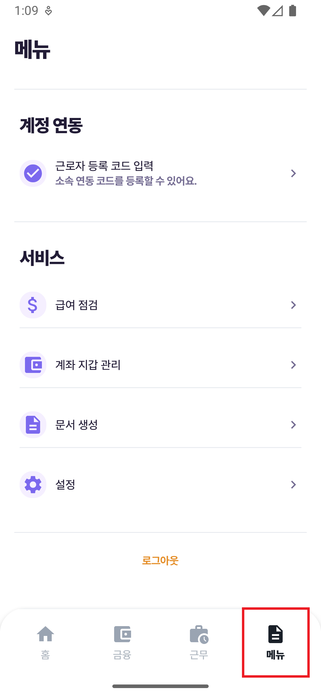 | 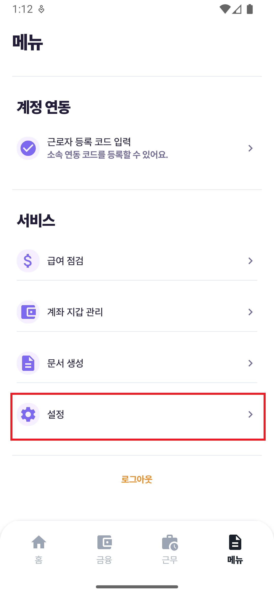 |

    | 한국어 모드 화면 1 | 한국어 모드 화면 2 |
    |---|---|
    | 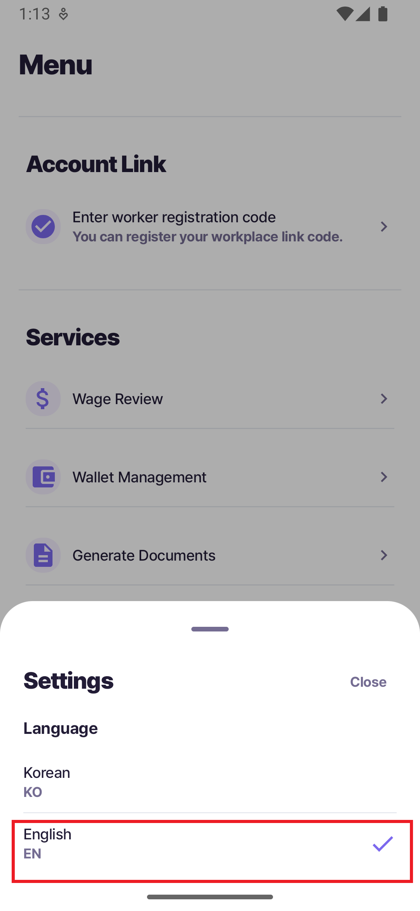 |  |

    - 발표자: 저희 서비스는 다중언어를 지원합니다.
    - 발표자: 지금은 시연을 위해 한국어 모드로 진행하겠습니다. (영어모드가 잘 작동하는지 보여준다.)

2. **GPS 기반 출퇴근**

    : 근로자가 이동 중에 앱에서 출근 체크를 진행하는 흐름입니다. GPS 위치를 확인한 뒤 출근 기록을 저장합니다.

    | 근무 탭 | GPS 확인 | 출근 확인 |
    |---|---|---|
    |  | 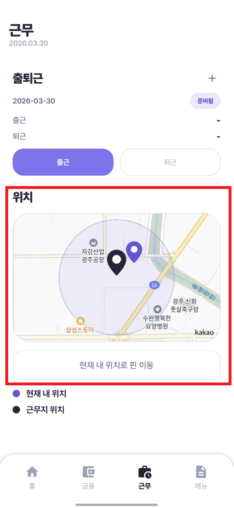 | 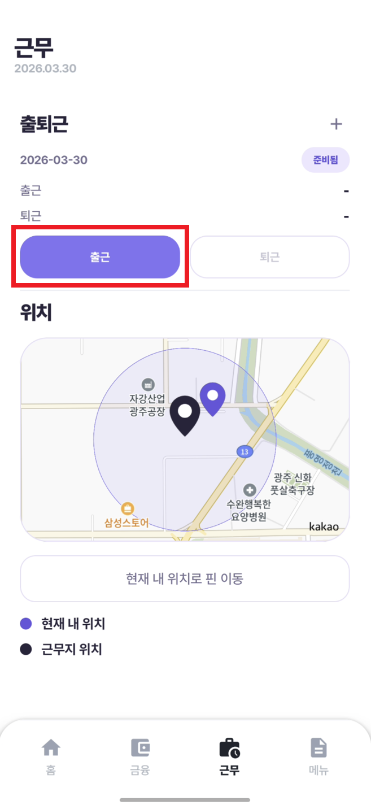 |

    - 발표자: GPS 기반으로 현재 위치를 확인하고 출근 기록이 남습니다.

3. **급여 점검**

    : 이번 달 지급액이 예상보다 적은 상황에서 급여 점검과 증빙 확인으로 원인을 추적하는 시나리오입니다.

    | 메뉴 탭 | 급여 점검 1 | 급여 점검 2 |
    |---|---|---|
    | 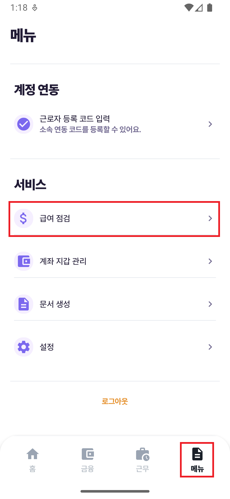 | 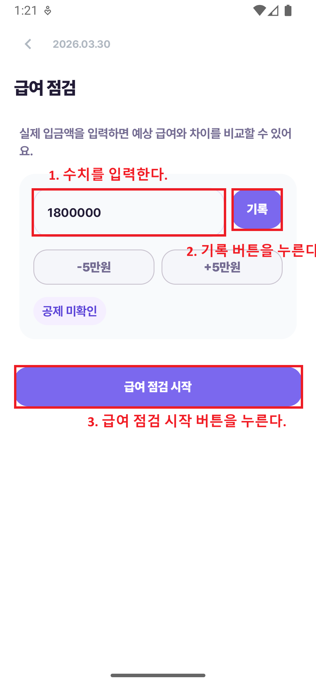 |  |

    | PDF 증빙 1 | PDF 증빙 2 | PDF 화면 |
    |---|---|---|
    | 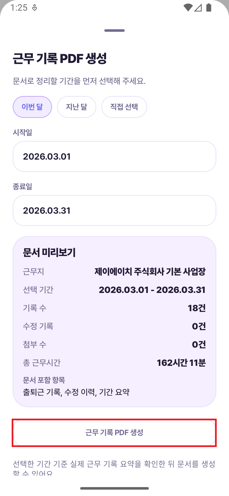 |  |  |

    - 발표자: 급여 점검 화면에서 기록, 지급 내역, 증빙 데이터를 함께 확인할 수 있습니다

4. **미리받기**

    : 근무 기록을 기반으로 미리받기 가능 금액을 확인하고, 고용주 승인 단계까지 연결하는 흐름입니다.
    (고용주 승인 웹 화면은 시연 흐름상 제외 하였습니다.)

    | 금융 탭 | 미리받기 1 | 한도 확인 |
    |---|---|---|
    | 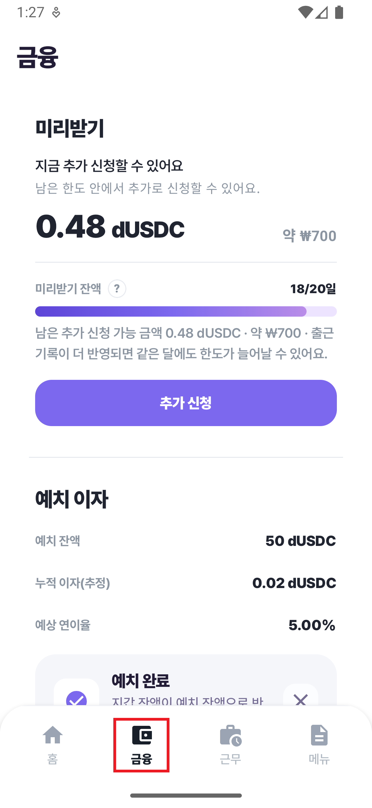 | 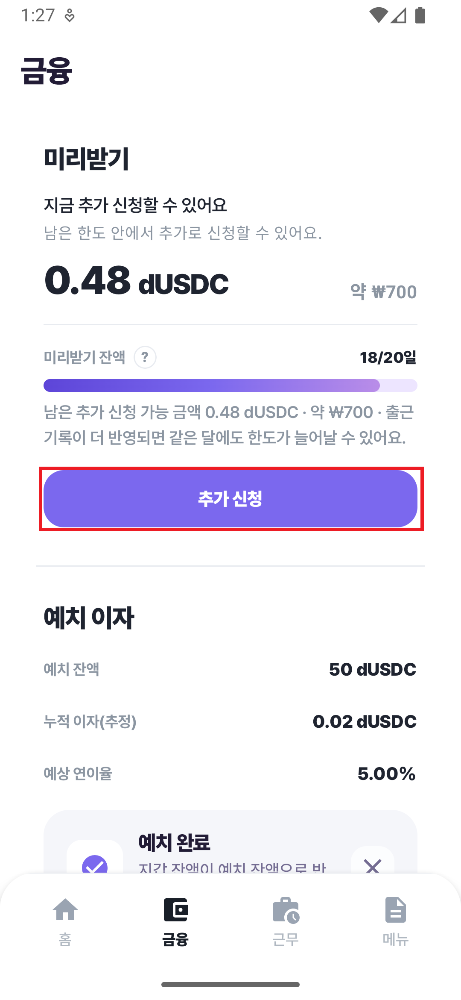 |  |

    | 미리받기 2 | 금액 확인 |
    |---|---|
    | 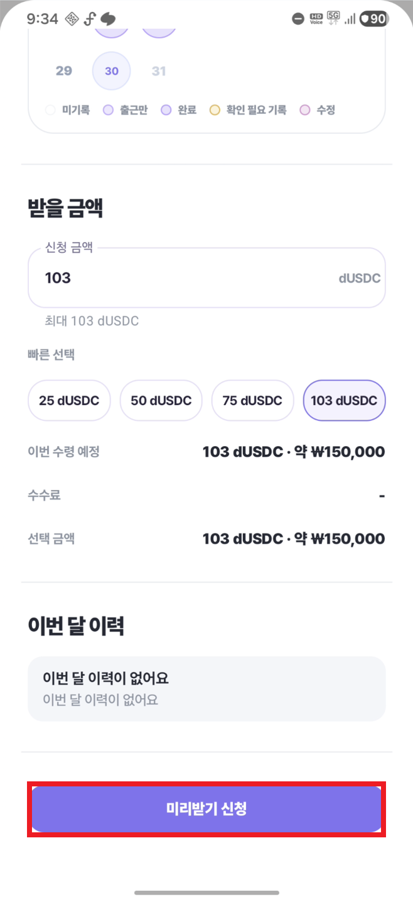 | 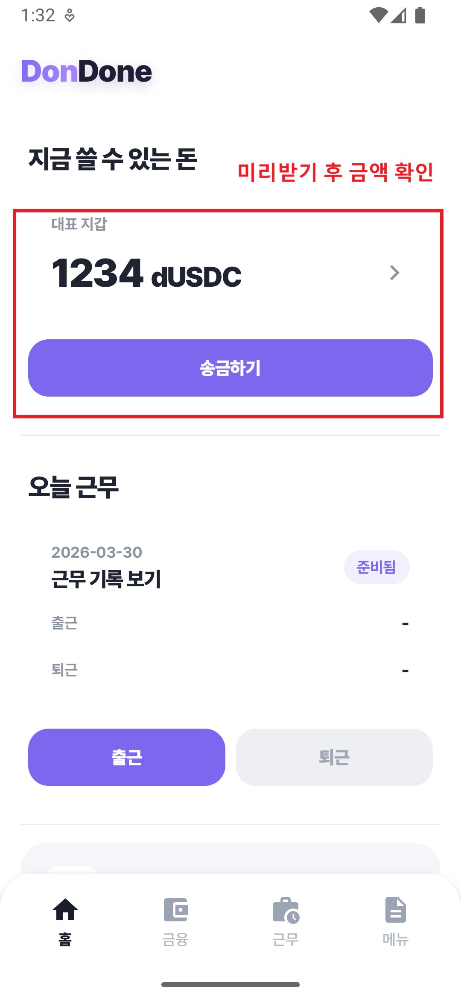 |

    - 발표자: 미리받기는 금융 탭에서 진입해 한도 확인, 미리받기, 금액 확인 순서로 진행합니다.

5. **송금**

    : 잔액 중 일부를 가족에게 송금하는 장면으로 송금 생성부터 완료 상태까지 확인합니다.

    | 송금 1 | 수신자 확인 | 송금 금액 선택 |
    |---|---|---|
    | 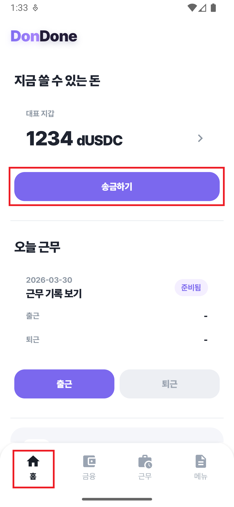 | 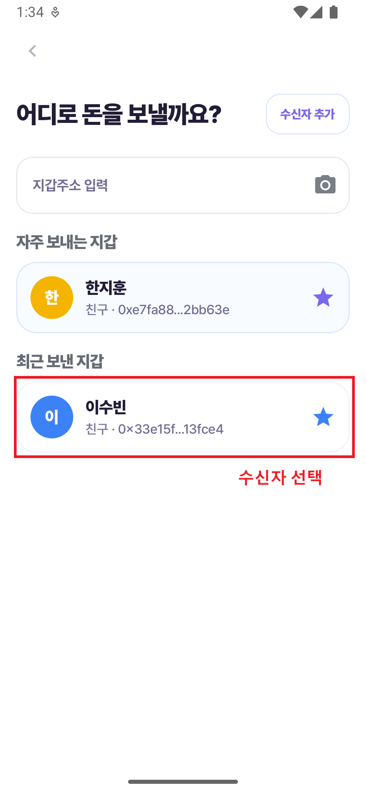 | 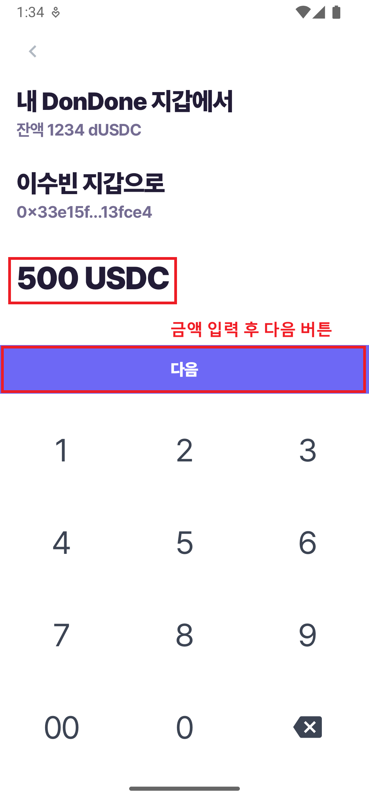 |

    | 송금 확인 화면 | 잔액 확인 |
    |---|---|
    | 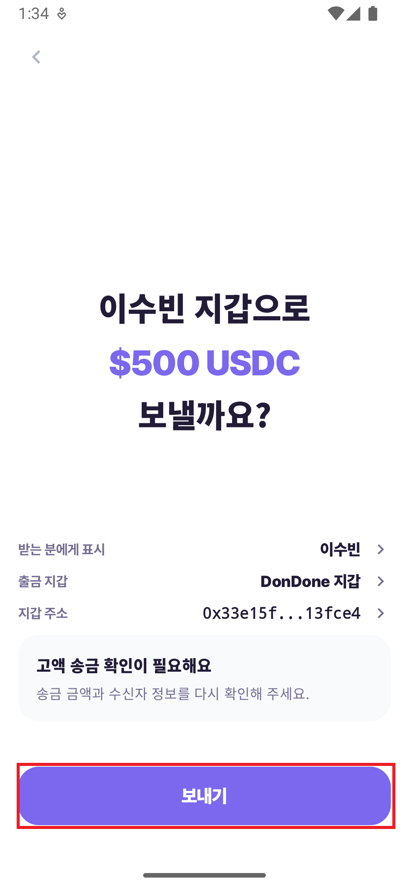 |  |

    - 발표자: 수취인 선택부터 송금 완료까지 상태를 확인할 수 있습니다.

6. **이자(예치)**

    : 남은 금액 일부를 예치하고, 예치 후 예상 이자 정보를 확인하는 마무리 단계입니다.

    | 예치 1 | 예치 2 | 예치 3 |
    |---|---|---|
    | 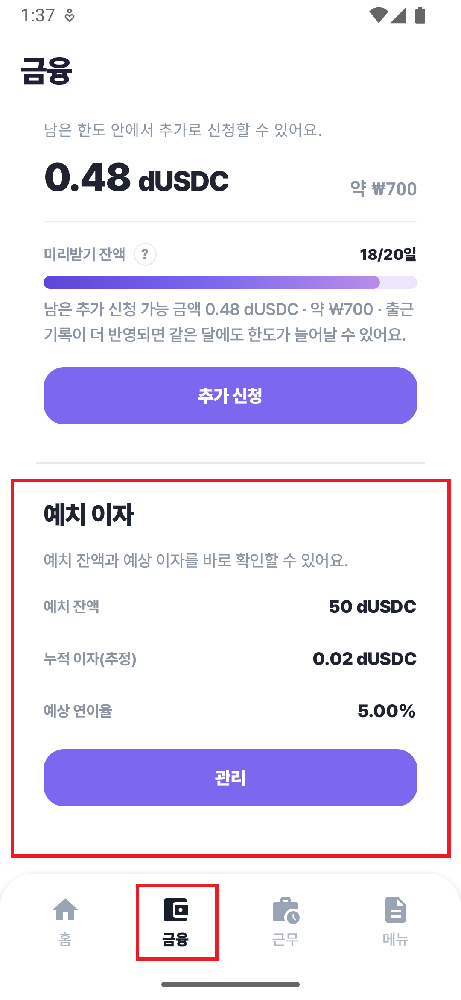 | 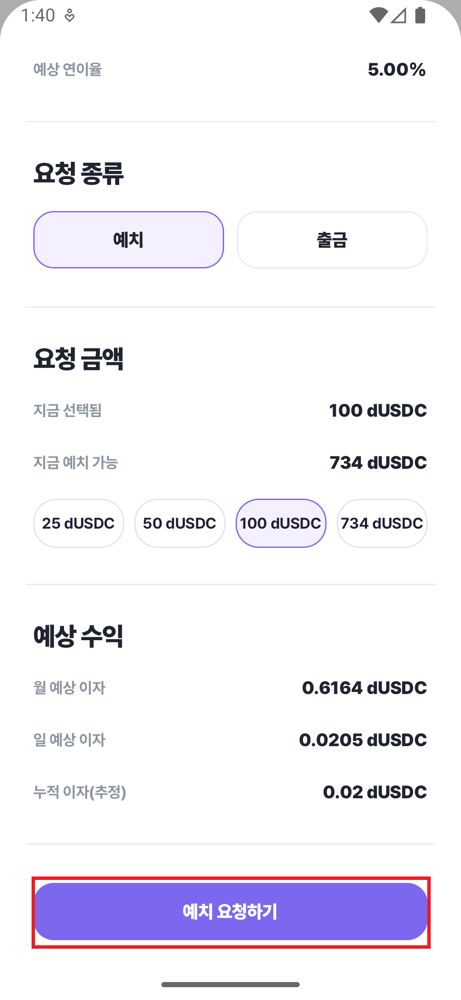 |  |

    - 발표자: 예치 기능을 통해 잔액 일부를 따로 보관하고, 예상 이자 정보를 함께 확인할 수 있습니다.
